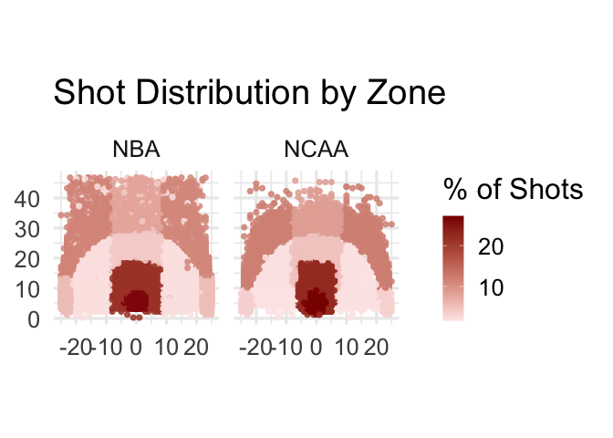
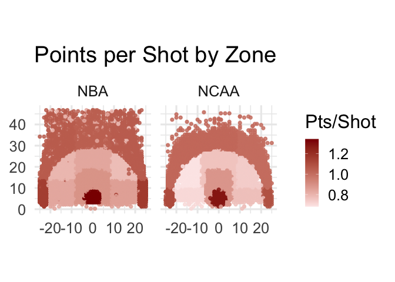

# The Three Point Revolution: NBA vs NCAA

### Data

I used play-by-play data from the 2025 NBA and NCAA seasons sourced from
the hoopR R package. I categorized shots into 12 zones on the court
based off the coordinates. NCAA data is filtered to only look at the top
100 teams.

### Questions

- Has the three point revolution effected NBA or NCAA teams more?
- Is the approach of shooting more threes correct?
- Does it generate more efficient offense?

### Plots

Here are a couple plots I used to help explore my research questions.

### Conclusion

I found that both NBA and NCAA teams are trying to limit mid range shots
and increase their three point attempts. The NBA has adopted this
philosophy more aggressively than the NCAA, but both leagues are
trending in the same direction. I also was able to determine that this
is the correct approach. Three pointers are much more valuable than mid
range shots, and generate a higher average of points per shot.

I also included an interactive shiny app for this project, allowing
users to compare shot distribution, field goal percentage, and points
per shot across NBA and NCAA teams or players.

The link to the app can be found here:
[ShinyApp](https://jacobilafferty.shinyapps.io/NBAvsNCAA/)
